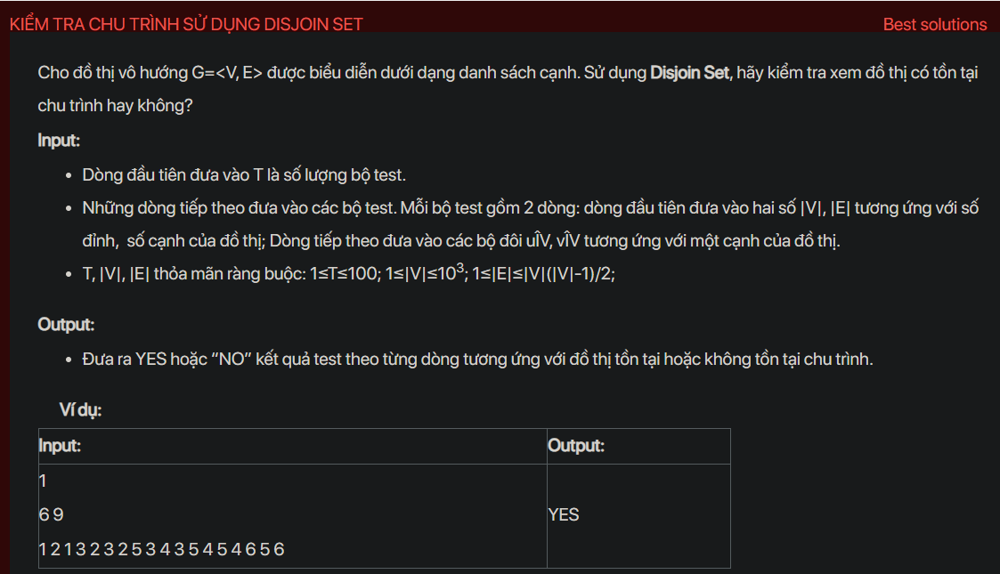

## dsa01003

Problem Analysis:
Given an undirected graph represented as an edge list, we need to determine if the graph contains a cycle or not.

Approach to Solution:
We can use a Disjoint Set (Union Find) data structure to solve this problem efficiently.

We will represent each set initially as a disjoint singleton set for each vertex.

For each edge(u, v) in the graph:

Find the set representative of u and v using the find operation.

If both u and v are in the same set, then there's a cycle. Return "YES."

Otherwise, perform the union operation by setting the representative of u's set to v's representative.

If no cycle is found after processing all edges, return "NO."

Implementation in C++:
```cpp
#include <iostream>

#include <vector>

using namespace std;

class DisjointSet {

private:

    vector<int> parent;

public:

    DisjointSet(int n) {

        parent.resize(n + 1, -1);

    }

    int find(int x) {

        if (parent[x] == -1)

            return x;

        return parent[x] = find(parent[x]);

    }

    void unionSets(int x, int y) {

        int rootX = find(x);

        int rootY = find(y);

        if (rootX != rootY)

            parent[rootX] = rootY;

    }

};

string hasCycle(vector<pair<int, int>>& edges, int n) {

    DisjointSet dsu(n);

    for (auto& edge : edges) {

        int u = edge.first;

        int v = edge.second;

        if (dsu.find(u) == dsu.find(v))

            return "YES";

        dsu.unionSets(u, v);

    }

    return "NO";

}

int main() {

    int t;

    cin >> t;

    while (t--) {

        int n, m;

        cin >> n >> m;


        vector<pair<int, int>> edges;

        for (int i = 0; i < m; i++) {

            int u, v;

            cin >> u >> v;

            edges.push_back({u, v});

        }

        cout << hasCycle(edges, n) << endl;

    }

    return 0;

}
```
Time Complexity Analysis:
Building the Disjoint Set data structure takes O(V) time.

Processing each edge and performing union operation takes O(log V) (amortized time complexity).

Overall time complexity is O(V + E * log V), where V is the number of vertices and E is the number of edges.