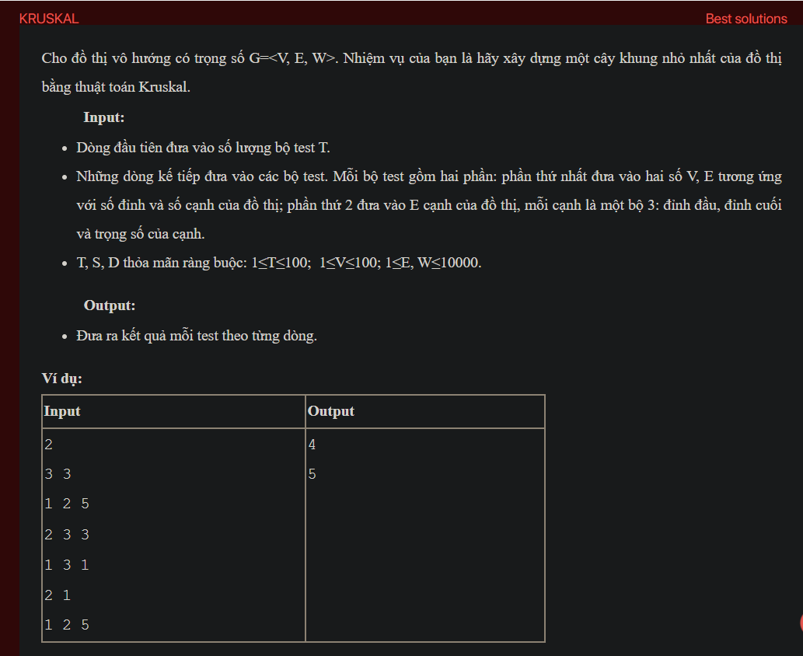

## dsa10015

Problem Analysis:
Given an undirected weighted graph, we need to construct the Minimum Spanning Tree (MST) of the graph using Kruskal's algorithm.

Approach to Solution:
Kruskal's algorithm is a greedy algorithm that finds the MST for a connected weighted graph.

We will sort the edges based on their weights in non-decreasing order.

We will use a Disjoint Set (Union Find) data structure to keep track of the connected components.

Iterate through the sorted edges and add an edge to the MST if it doesn't form a cycle.

We continue this process until there are V-1 edges in the MST (where V is the number of vertices).

The resulting set of edges forms the Minimum Spanning Tree.

Implementation in C++:
```cpp
#include <iostream>

#include <vector>

#include <algorithm>

using namespace std;

class DisjointSet {

private:

    vector<int> parent, rank;

public:

    DisjointSet(int n) {

        parent.resize(n + 1);

        rank.resize(n + 1, 0);

        for (int i = 0; i <= n; i++)

            parent[i] = i;

    }

    int find(int x) {

        if (x != parent[x])

            parent[x] = find(parent[x]);

        return parent[x];

    }

    void unionSets(int x, int y) {

        int rootX = find(x);

        int rootY = find(y);

        if (rootX != rootY) {

            if (rank[rootX] < rank[rootY])

                swap(rootX, rootY);

            parent[rootY] = rootX;

            if (rank[rootX] == rank[rootY])

                rank[rootX]++;

        }

    }

};

struct Edge {

    int u, v, w;

};

bool edgeComparator(const Edge& a, const Edge& b) {

    return a.w < b.w;

}

vector<Edge> kruskalMST(vector<Edge>& edges, int V) {

    sort(edges.begin(), edges.end(), edgeComparator);

    DisjointSet dsu(V);

    vector<Edge> mst;

    for (const Edge& edge : edges) {

        int u = edge.u;

        int v = edge.v;

        int w = edge.w;

        if (dsu.find(u) != dsu.find(v)) {

            mst.push_back({u, v, w});

            dsu.unionSets(u, v);

        }

    }

    return mst;

}

int main() {

    int T;

    cin >> T;

    while (T--) {

        int V, E;

        cin >> V >> E;

        vector<Edge> edges;

        for (int i = 0; i < E; i++) {

            int u, v, w;

            cin >> u >> v >> w;

            edges.push_back({u, v, w});

        }

        vector<Edge> mst = kruskalMST(edges, V);

        int mstCost = 0;

        for (const Edge& edge : mst) {

            mstCost += edge.w;

        }

        cout << mstCost << endl;

    }

    return 0;

}
```
Time Complexity Analysis:
Sorting the edges takes O(E log E) time.

Performing the find and union operations for each edge takes O(E log V) time.

Overall time complexity is O(E log E + E log V), where V is the number of vertices and E is the number of edges.