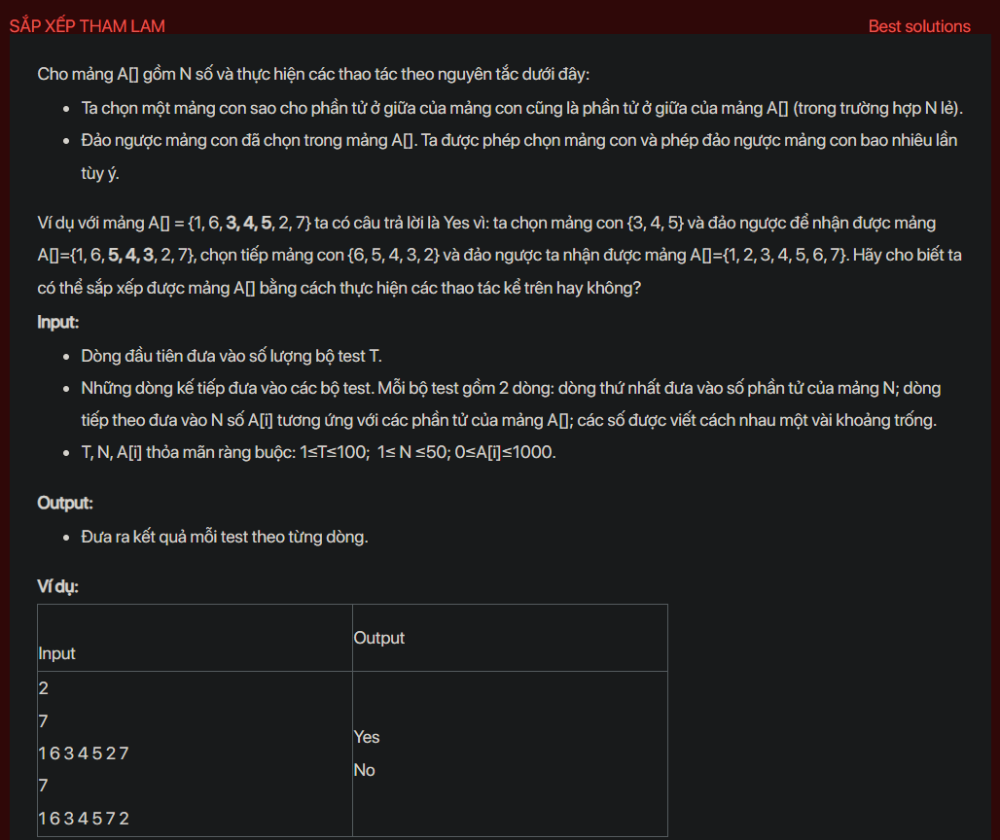

## dsa03006

## Approach
Because you can reverse subarray to sort the original array so we must have 2 arrays, original array and the sorted array. We have to check if at any index and the symmetric index, the value is not equal (a[i] != b[i] && a[i] != b[n - i - 1] (because we might reverse the array))