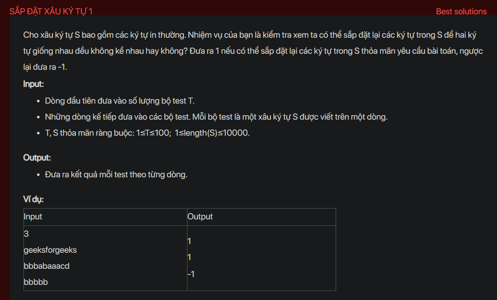

## dsa03012


## Approach
This problem can be solved using a priority queue and a map. Here's a step-by-step explanation of how to solve this problem:

1. **Analyse the problem:** We need to check if we can rearrange the characters in a string such that no two identical characters are adjacent to each other.

2. **Thinking chain to come up with the solution:** We can solve this problem by counting the frequency of each character and storing them in a priority queue. The priority queue is ordered by the frequency of the characters, so the character with the highest frequency is always at the top. We then try to build the rearranged string by always taking the character with the highest frequency that is not the same as the last character added to the string. If we can't find such a character, it means that we can't rearrange the string as required.

3. **Implement in C++:** 

```cpp
#include <bits/stdc++.h>
using namespace std;

void testCase() {
    string s;
    cin >> s;
    map<char, int> count;
    for (char c : s) {
        count[c]++;
    }
    priority_queue<pair<int, char>> pq;
    for (auto it : count) {
        pq.push({it.second, it.first});
    }
    string result;
    pair<int, char> prev = {-1, '#'};
    while (!pq.empty()) {
        pair<int, char> curr = pq.top();
        pq.pop();
        result += curr.second;
        if (prev.first > 0) {
            pq.push(prev);
        }
        curr.first--;
        prev = curr;
    }
    if (s.size() != result.size()) {
        cout << -1;
    } else {
        cout << 1;
    }
}

int main() {
    int t;
    cin >> t;
    while (t--) {
        testCase();
        cout << endl;
    }
    return 0;
}
```

4. **Analyse time complexity:** The time complexity of this solution is O(n log n), where `n` is the length of the string. This is because we are processing each character once and inserting it into a priority queue, which takes log n time. The space complexity is O(n), as we are storing all the characters in a map and a priority queue.