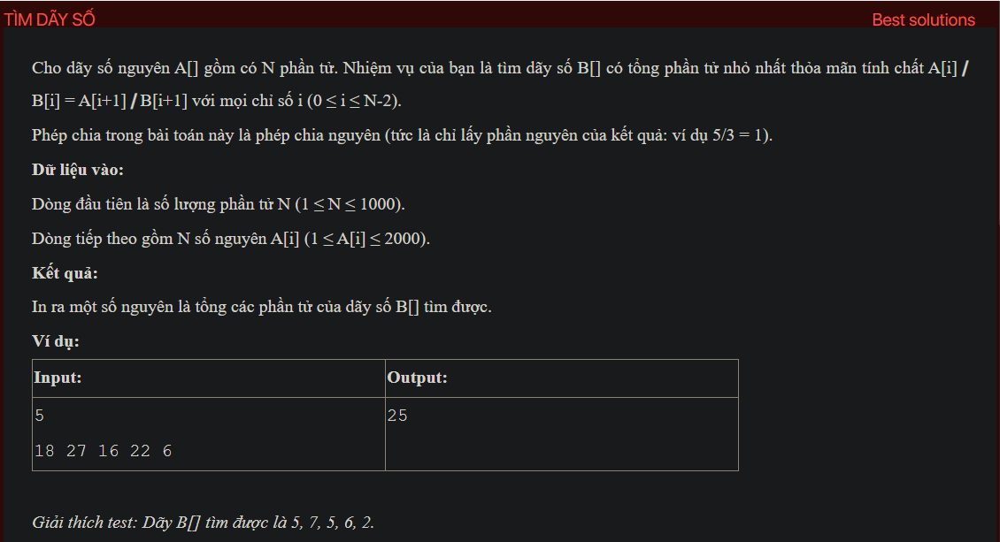

## dsa03021

## Explain
Sure, let's break down the algorithm in your code:

1. **Initialization:** The code starts by defining a function `testCase` and a helper function `check`.

2. **Reading the input:** The `testCase` function reads an integer `n` from the input, which represents the size of the array. Then, it reads `n` integers into the array `a`.

3. **Sorting the array:** The `testCase` function sorts the array `a` in ascending order. This is done to make it easier to find the minimum value in the array, which is now at the beginning of the array.

4. **Checking each possible value:** The `testCase` function then iterates over each integer `i` from `a[0]` (the minimum value in the array) down to 1. For each `i`, it calls the `check` function to see if `i` is a valid value.

5. **Checking a value:** The `check` function checks whether a given value `i` is valid. It does this by iterating over each element `x` in the array and checking whether `x / i` is equal to `x / (i + 1)`. If it finds an element for which this is true, it returns `false`, indicating that `i` is not a valid value. If it doesn't find any such element, it returns `true`, indicating that `i` is a valid value.

6. **Calculating the result:** If the `check` function returns `true` for a value `i`, the `testCase` function calculates the result as the sum of `x / (i + 1) + 1` for each element `x` in the array. This represents the minimum possible sum of the elements in the array after each element has been divided by `i + 1` and rounded up.

7. **Printing the result:** Finally, the `testCase` function prints the calculated result and returns.

This algorithm essentially tries each possible value from the minimum value in the array down to 1, checks whether it is a valid value, and if it is, calculates and prints the minimum possible sum of the elements in the array after each element has been divided by this value and rounded up. It uses a greedy approach, trying the largest possible value first and stopping as soon as it finds a valid value.