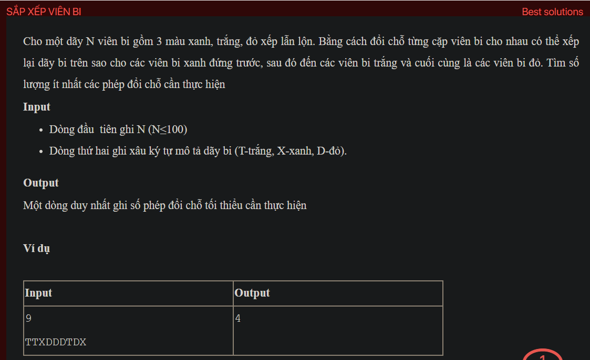

## dsa03023

## Explain
Sure, let's break down the algorithm in your code:

1. **Initialization:** The code starts by defining a function `comp` that compares two characters in descending order. Then, it defines the `main` function.

2. **Reading the input:** The `main` function reads an integer `n` from the input, which represents the number of balls. Then, it reads a string `s` representing the colored balls.

3. **Sorting the string:** The `main` function creates a copy `st` of the string `s` and sorts `s` in descending order using the `comp` function. This results in a string where all red balls ('D') come first, followed by white balls ('T'), and then blue balls ('X').

4. **Comparing the strings:** The `main` function then iterates over the strings `st` and `s`. For each position `i`, if the ball in `st` at position `i` is not the same as the ball in `s` at position `i`, it creates a pair of balls `ss` consisting of the ball in `st` at position `i` and the ball in `s` at position `i`, and a reversed pair `rs`.

5. **Counting the swaps:** If the reversed pair `rs` is in the multiset `ms`, it removes `rs` from `ms` and increments `d1`. This represents a swap that has been made. Otherwise, it inserts `ss` into `ms`. This represents a swap that hasn't been made yet.

6. **Calculating the result:** After iterating over all positions, the function calculates the number of swaps as `d1` plus two thirds of the size of `ms`. This is because each pair in `ms` represents a swap that hasn't been made yet, and each swap moves two balls to their correct positions, so two thirds of the pairs in `ms` can be made without moving any ball out of its correct position.

7. **Printing the result:** Finally, the `main` function prints the calculated number of swaps.

This algorithm essentially calculates the minimum number of swaps required to sort the string of colored balls by comparing the original string with the sorted string and keeping track of the swaps that have been made and the swaps that haven't been made yet. It uses a multiset to efficiently count the number of each pair of balls and to quickly find and remove any reversed pair.