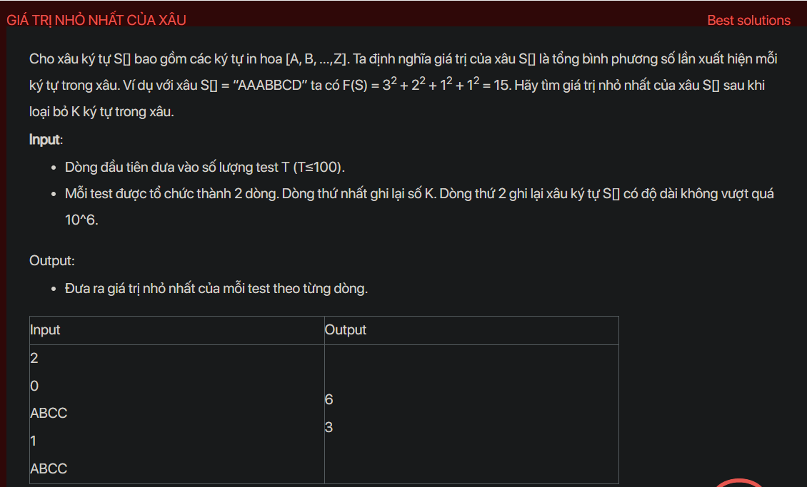

## dsa08004

## Explain
The problem is about finding the minimum possible value of a string `S` after removing `K` characters. The value of `S` is defined as the sum of the squares of the frequencies of each character in `S`.

Here's a step-by-step explanation of the algorithm used in your code:

1. **Initialization:** The code first reads the number of test cases `t`. For each test case, it reads the number `k` of characters to remove and the string `s`. It also initializes an array `dd` to count the frequencies of the characters and a priority queue `q` to store the frequencies.

2. **Counting the frequencies:** The code then iterates over the characters of `s`. For each character `s[i]`, it increments `dd[s[i]]`.

3. **Storing the frequencies:** The code then iterates over the elements of `dd`. For each element `dd[i]` that is greater than 0, it pushes `dd[i]` onto `q`.

4. **Removing characters:** The code then performs `k` iterations. In each iteration, it pops the top of `q`, decrements it, and pushes it back onto `q`. If `q` becomes empty, it breaks the loop.

5. **Calculating the value:** The code then initializes a variable `ans` to 0. While `q` is not empty, it pops the top of `q`, squares it, and adds it to `ans`.

6. **Output:** Finally, the code outputs `ans`.

The reason this algorithm works is that it uses a priority queue to keep track of the frequencies of the characters. The priority queue is a max heap, so the top of the queue is always the maximum frequency. In each iteration, the code removes one occurrence of the character with the maximum frequency. This ensures that the value of `s` is minimized.

```cpp
#include <bits/stdc++.h>
using namespace std;
void testCase();
int main() {
    // Write your code here
    #ifndef ONLINE_JUDGE
    freopen("input.txt", "r", stdin);
    freopen("output.txt", "w", stdout);
    #endif
    int t;
    cin >> t;
    while (t--) {
        testCase();
        cout << endl;
    }
    return 0;
}
void testCase() {
    int k; cin >> k;
    string s; cin >> s;
    int dd[127] = {};
    for (char i : s) dd[i]++;
    priority_queue<int> q;
    for (int i : dd) {
        if (i > 0) q.push(i);
    }
    while (k--) {
        if (q.empty()) break;
        int x = q.top(); q.pop();
        x--;
        q.push(x);
    }
    long long ans = 0;
    while (!q.empty()) {
        long long x = q.top(); q.pop();
        ans += x * x;
    }
    cout << ans;
}
```