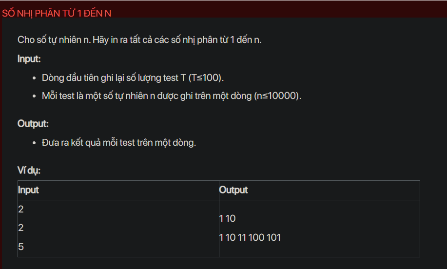

## dsa08005

## Approach
**Problem Analysis:**

The problem is asking to print all the binary numbers from 1 to n for each test case.

**Solution Analysis:**

We can solve this problem by using a queue data structure. We start by pushing "1" into the queue. Then we start a loop where we pop an element from the queue, print it and append "0" and "1" at the end of the popped element and push them into the queue. This will generate all binary numbers up to n.

**Implementation in C++:**

```cpp
#include<bits/stdc++.h>
using namespace std;

void printBinaries(int n) {
    queue<string> q;
    q.push("1");
    while (n--) {
        string s1 = q.front();
        q.pop();
        cout << s1 << " ";
        string s2 = s1;
        q.push(s1.append("0"));
        q.push(s2.append("1"));
    }
}

int main() {
    int T;
    cin >> T;
    while (T--) {
        int n;
        cin >> n;
        printBinaries(n);
        cout << endl;
    }
    return 0;
}
```

**Time Complexity Analysis:**

The time complexity of the solution is O(n) where n is the input number. This is because we are generating n binary numbers. The space complexity is also O(n) for the queue.