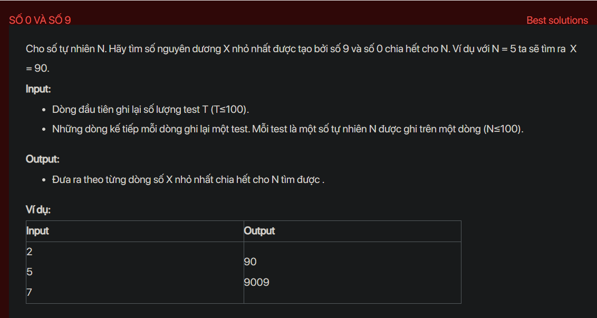

## dsa08006

## Approach
**Problem Analysis:**

The problem is asking to find the smallest number composed of digits 0 and 9 that is divisible by a given number N.

**Solution Analysis:**

We can solve this problem by using a queue and breadth-first search (BFS). We start by pushing "9" (as a string) into the queue. Then we start a loop where we pop an element from the queue, check if it is divisible by N. If it is, we print it and break the loop. If it is not, we append "0" and "9" at the end of the popped element and push them into the queue. This will generate all numbers composed of 0 and 9 in increasing order until we find one that is divisible by N.

**Implementation in C++:**

```cpp
#include<bits/stdc++.h>
using namespace std;

void findSmallest(int N) {
    queue<string> q;
    q.push("9");
    while (true) {
        string s1 = q.front();
        q.pop();
        int rem = 0;
        for (int i = 0; i < s1.size(); i++) {
            rem = (rem * 10 + (s1[i] - '0')) % N;
        }
        if (rem == 0) {
            cout << s1 << endl;
            break;
        }
        else {
            string s2 = s1;
            q.push(s1.append("0"));
            q.push(s2.append("9"));
        }
    }
}

int main() {
    int T;
    cin >> T;
    while (T--) {
        int N;
        cin >> N;
        findSmallest(N);
    }
    return 0;
}
```

**Time Complexity Analysis:**

The time complexity of the solution is O(N) where N is the input number. This is because in the worst case, we may generate all numbers up to N. The space complexity is also O(N) for the queue.