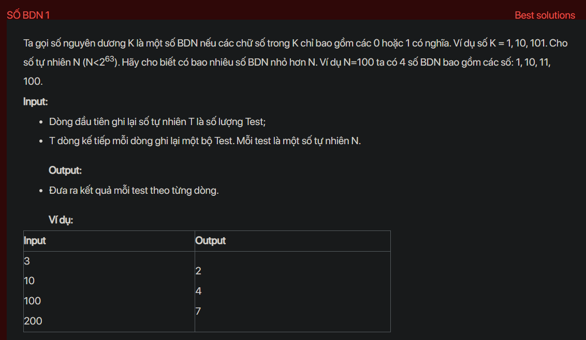

## dsa08007


## Approach
**Solution Analysis:**

We can solve this problem by using a queue and breadth-first search (BFS). We start by pushing "1" (as a string) into the queue. Then we start a loop where we pop an element from the queue, convert it to a number and check if it is less than N. If it is, we count it as a BDN, append "0" and "1" at the end of the popped element and push them into the queue. This will generate all BDNs in increasing order until we reach N.

**Implementation in C++:**

```cpp
#include<bits/stdc++.h>
using namespace std;

int countBDN(long long N) {
    queue<string> q;
    q.push("1");
    int count = 0;
    while (true) {
        string s1 = q.front();
        q.pop();
        if (stoll(s1) < N) {
            count++;
            string s2 = s1;
            q.push(s1.append("0"));
            q.push(s2.append("1"));
        } else {
            break;
        }
    }
    return count;
}

int main() {
    int T;
    cin >> T;
    while (T--) {
        long long N;
        cin >> N;
        cout << countBDN(N) << endl;
    }
    return 0;
}
```

**Time Complexity Analysis:**

The time complexity of the solution is O(log N) where N is the input number. This is because in the worst case, we may generate all BDNs up to N. The space complexity is also O(log N) for the queue.