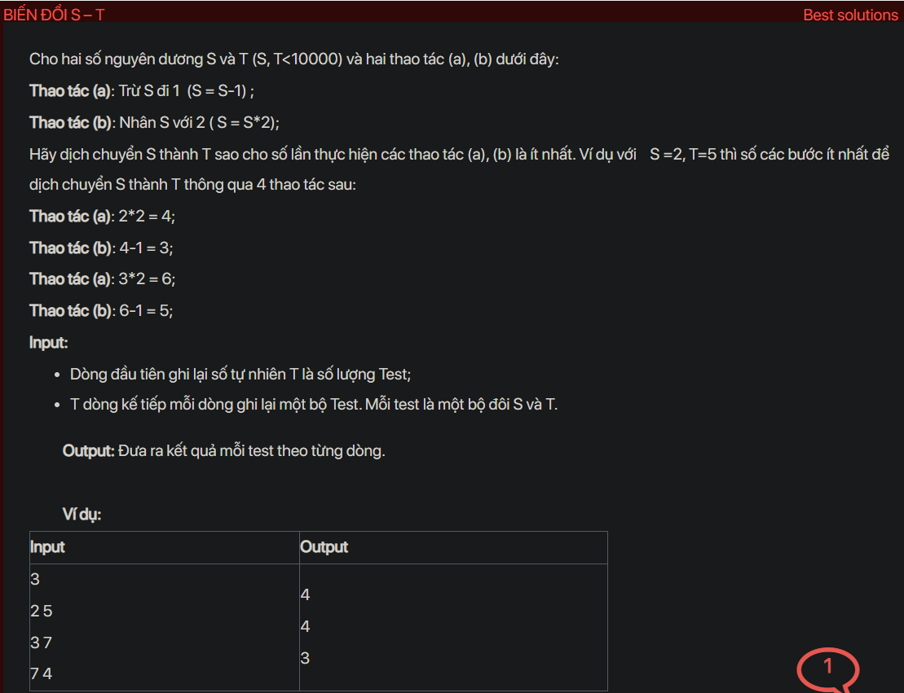

## dsa08009


## Explain
The problem is about transforming a number `S` into another number `T` using the least number of operations. The operations are subtracting 1 from `S` and multiplying `S` by 2.

Here's a step-by-step explanation of the algorithm used in your code:

1. **Initialization:** The code first reads the number of test cases `T`. For each test case, it reads the numbers `S` and `T`. It also initializes a queue `q` to keep track of the current number and the number of operations performed, and a map `mp` to keep track of the numbers that have been visited.

2. **Processing the test case:** The code then performs a breadth-first search (BFS) starting from `S`. In each step of the BFS:

   - It dequeues a pair `p` from `q`. `p.first` is the current number and `p.second` is the number of operations performed.

   - If `p.first` is equal to `T`, it outputs `p.second` and returns.

   - If `p.first - 1` is equal to `T` or `p.first * 2` is equal to `T`, it outputs `p.second + 1` and returns.

   - If `p.first * 2` is less than or equal to `T * 2` and `p.first * 2` has not been visited, it enqueues `{p.first * 2, p.second + 1}` and marks `p.first * 2` as visited.

   - If `p.first - 1` is greater than or equal to 0 and `p.first - 1` has not been visited, it enqueues `{p.first - 1, p.second + 1}` and marks `p.first - 1` as visited.

The reason this algorithm works is that it uses BFS to explore all possible sequences of operations. BFS ensures that the first time a number is visited, it is visited with the least number of operations. Therefore, when `T` is visited, it is visited with the least number of operations.

```cpp
// https://code.ptit.edu.vn/student/question/DSA08009
// BIẾN ĐỔI S – T

#include <bits/stdc++.h>
using namespace std;

void testCase() {
    int s, t;
    cin >> s >> t;
    queue<pair<int, int>> q;
    map<int, bool> mp;
    q.push({s, 0});
    while (!q.empty()) {
        pair<int, int> p = q.front(); q.pop();
        if (p.first == t) {
            cout << p.second;
            return;
        }
        if (p.first - 1 == t || p.first * 2 == t) {
            cout << p.second + 1;
            return;
        }


        if (p.first * 2 <= t * 2 && mp[p.first * 2] == 0) {
            q.push({p.first * 2, p.second + 1});
            mp[p.first * 2] = 1;
        }
        if (p.first - 1 >= 0 && mp[p.first - 1] == 0) {
            q.push({p.first - 1, p.second + 1});
            mp[p.first - 1] = 1;
        }
    }
}

int main() {
    ios_base::sync_with_stdio(false);
    cin.tie(NULL); cout.tie(NULL);
    #ifndef ONLINE_JUDGE
    freopen("input.txt", "r", stdin);
    freopen("output.txt", "w", stdout);
    #endif
    int T = 1; cin >> T;
    while (T--) {
        testCase();
        cout << "\n";
    }
    return 0;
}
```