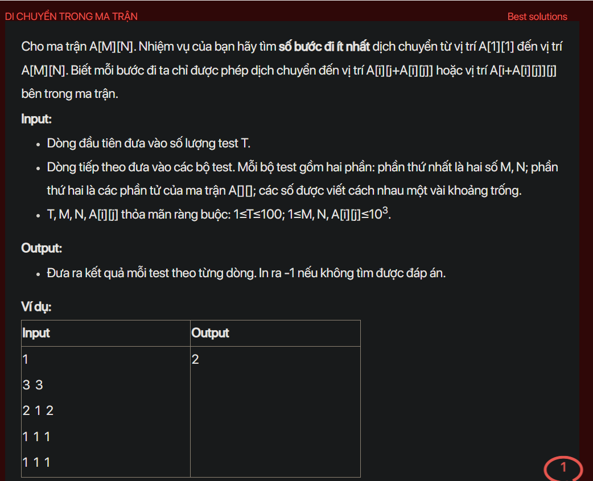

## dsa08021

## Approach
**Problem Analysis:**

The problem is asking to find the minimum number of steps to move from the top left cell to the bottom right cell of a matrix. In each step, we can move to the right or down by the number of steps equal to the value of the current cell. If it is not possible to reach the bottom right cell, return -1.

**Solution Analysis:**

This problem can be solved using Breadth-First Search (BFS). The idea is to start from the top left cell and explore all possible cells by moving to the right or down by the number of steps equal to the value of the current cell. 

The algorithm can be described as follows:

1. Initialize a queue and a visited matrix. Add the top left cell to the queue and mark it as visited.

2. While the queue is not empty, remove the front cell from the queue. If this cell is the bottom right cell, return its distance from the top left cell.

3. For each possible move to the right or down, if the new cell is valid and not visited, add it to the queue and mark it as visited.

4. If no cell is added to the queue, return -1.

**Implementation in C++:**

```cpp
#include <bits/stdc++.h>
using namespace std;

int bfs(vector<vector<int>>& matrix, int M, int N) {
    vector<vector<int>> visited(M, vector<int>(N, -1));
    queue<pair<int, int>> q;
    visited[0][0] = 0;
    q.push({0, 0});
    while (!q.empty()) {
        int x = q.front().first;
        int y = q.front().second;
        q.pop();
        if (x == M - 1 && y == N - 1) return visited[x][y];
        int steps = matrix[x][y];
        if (x + steps < M && visited[x + steps][y] == -1) {
            visited[x + steps][y] = visited[x][y] + 1;
            q.push({x + steps, y});
        }
        if (y + steps < N && visited[x][y + steps] == -1) {
            visited[x][y + steps] = visited[x][y] + 1;
            q.push({x, y + steps});
        }
    }
    return -1;
}

int main() {
    int T;
    cin >> T;
    while (T--) {
        int M, N;
        cin >> M >> N;
        vector<vector<int>> matrix(M, vector<int>(N));
        for (int i = 0; i < M; i++) {
            for (int j = 0; j < N; j++) {
                cin >> matrix[i][j];
            }
        }
        cout << bfs(matrix, M, N) << endl;
    }
    return 0;
}
```

**Time Complexity Analysis:**

The time complexity of the solution is O(M*N) as in the worst case, we may have to visit all cells in the matrix. The space complexity is O(M*N) as we are storing the matrix and the visited matrix. This is efficient enough for the given problem constraints (1 <= M, N <= 10^3).