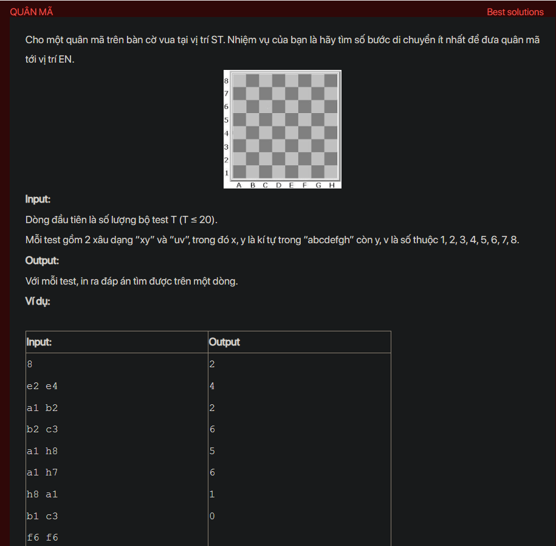

## dsa08025

## Approach
Problem Analysis:
The problem is asking to find the minimum number of moves for a knight in a chess game to move from one position to another. The knight moves in an L shape: it can move two squares horizontally and one square vertically, or two squares vertically and one square horizontally.

Solution Analysis:
We can solve this problem using breadth-first search (BFS) on a graph where the nodes are the positions on the chessboard and the edges are the valid knight moves. The idea is to start from the initial position and perform all valid knight moves, then enqueue the new positions and mark them as visited. We continue this process until we reach the target position. We use a queue to keep track of the positions to be processed and a 2D array to keep track of the minimum number of moves to reach each position.

Implementation in C++:

```cpp
#include<bits/stdc++.h>
using namespace std;

int dx[] = {-2, -1, 1, 2, -2, -1, 1, 2};
int dy[] = {-1, -2, -2, -1, 1, 2, 2, 1};

int minMoves(pair<int, int> start, pair<int, int> end) {
    vector<vector<int>> dist(8, vector<int>(8, -1));
    queue<pair<int, int>> q;
    q.push(start);
    dist[start.first][start.second] = 0;
    while (!q.empty()) {
        pair<int, int> cur = q.front();
        q.pop();
        for (int i = 0; i < 8; i++) {
            int nx = cur.first + dx[i];
            int ny = cur.second + dy[i];
            if (nx >= 0 && nx < 8 && ny >= 0 && ny < 8 && dist[nx][ny] == -1) {
                q.push({nx, ny});
                dist[nx][ny] = dist[cur.first][cur.second] + 1;
                if (nx == end.first && ny == end.second) {
                    return dist[nx][ny];
                }
            }
        }
    }
    return -1;
}

int main() {
    int T;
    cin >> T;
    while (T--) {
        string s, e;
        cin >> s >> e;
        pair<int, int> start = {s[0] - 'a', s[1] - '1'};
        pair<int, int> end = {e[0] - 'a', e[1] - '1'};
        cout << minMoves(start, end) << endl;
    }
    return 0;
}
```

Time Complexity Analysis:
The time complexity of the above solution is O(1) for each test case, because the size of the chessboard is fixed (8x8). The space complexity is O(1) for the queue and the 2D array.