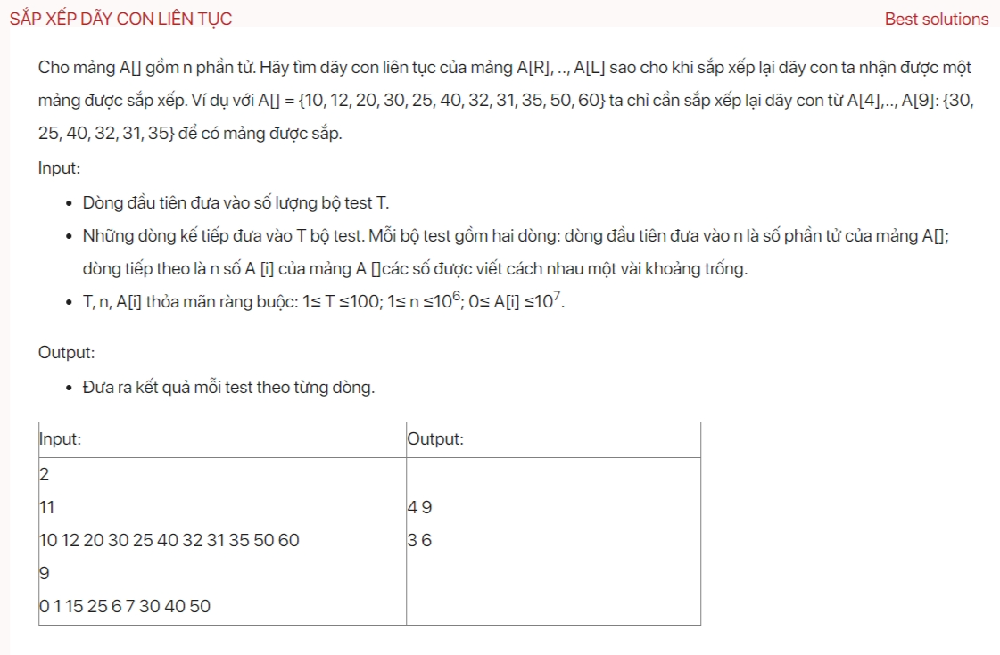

## dsa06007

### Algorithm
Your current implementation is almost correct, but there are a few issues:

1. The conditions in your while loops are reversed. You should increment `l` while `a[l] <= a[l + 1]` and decrement `r` while `a[r] >= a[r - 1]`.

2. You need to handle the case where the array is already sorted. If `l` reaches `n - 1`, it means the array is already sorted and you should print a suitable message or value.

3. After finding `l` and `r`, you need to extend the subarray to include any out-of-order elements. This can be done by finding the minimum and maximum values in the subarray, and then extending the subarray while `a[l - 1] > min_val` and `a[r + 1] < max_val`.

Here's the corrected `testCase` function:

```cpp
void testCase() {
    int n;
    cin >> n;
    int a[n];
    for (int i = 0; i < n; i++) {
        cin >> a[i];
    }
    int l = 0, r = n - 1;
    while (l < n - 1 && a[l] <= a[l + 1]) {
        l++;
    }
    if (l == n - 1) {  // The array is already sorted
        cout << "The array is already sorted";
        return;
    }
    while (r > 0 && a[r] >= a[r - 1]) {
        r--;
    }
    int max_val = *max_element(a + l, a + r + 1);
    int min_val = *min_element(a + l, a + r + 1);
    while (l > 0 && a[l - 1] > min_val) {
        l--;
    }
    while (r < n - 1 && a[r + 1] < max_val) {
        r++;
    }
    cout << l << " " << r;
}
```

This function now correctly finds the smallest subarray that needs to be sorted. If the array is already sorted, it prints a suitable message.

Complexity: O(n);

#### Another solution

```
void testCase() {
    int n; cin >> n;
    vector<int> a(n);
    for (int &i : a) cin >> i;
    vector<int> b = a;
    sort(a.begin(), a.end());
    int i = 0, j = n - 1;
    while (a[i] == b[i]) i++;
    while (a[j] == b[j] && j > i) j--;
    cout << i + 1 << " " << j + 1;
}
```

Complexity: O(nlogn) for using `sort` function