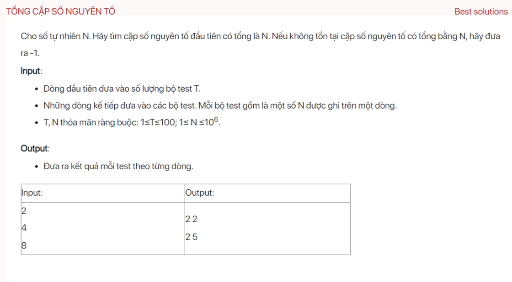

## dsa06014

### Time complexity
The time complexity of your code can be broken down as follows:

1. **sieve function**: This function implements the Sieve of Eratosthenes algorithm to generate all prime numbers up to `MAX_SIZE`. The time complexity of this algorithm is O(n log log n), where n is `MAX_SIZE` in this case.

2. **testCase function**: This function iterates over the first half of the numbers up to `n` and checks if each number and its complement to `n` are prime. The time complexity of this operation is O(n/2) = O(n), where n is the input number.

3. **main function**: This function reads the number of test cases and calls the `testCase` function for each test case. The time complexity of this operation is O(t * n), where t is the number of test cases and n is the input number.

Therefore, the overall time complexity of your code is dominated by the `main` function and is O(t * n), assuming that `n` is the maximum input number. The `sieve` function only runs once and its time complexity O(n log log n) is not dependent on the number of test cases, so it doesn't affect the overall time complexity.