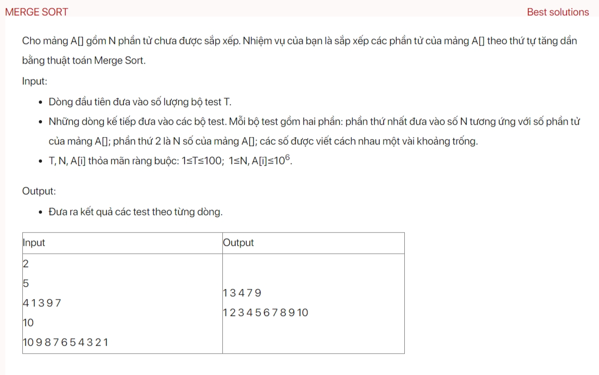

## dsa06015

### More information about Merge Sort: 
https://www.youtube.com/live/6p4SND-v9TM?si=in4uE4gGHFxuISA2&t=4992

### Time complexity
The provided code is an implementation of the Merge Sort algorithm. Here's the breakdown of its time complexity:

1. **mergeSort function**: This function recursively divides the array into two halves until we reach the base case where the array has only one element. Then, it merges the halves in a sorted manner. The time complexity of this function is O(n log n), where n is the size of the array. This is because the array is divided into two at each level and there are log n levels, and merging at each level takes O(n) time.

2. **merge function**: This function merges two sorted halves of an array. It scans both halves and copies the smaller element to a temporary array, then copies the remaining elements from the unfinished half. The time complexity of this function is O(n), where n is the size of the array.

3. **testCase function**: This function reads an array from the input, sorts it using the mergeSort function, and prints the sorted array. The time complexity of this function is O(n log n) for sorting the array, and O(n) for reading and printing the array. Therefore, the overall time complexity is O(n log n + n) = O(n log n).

4. **main function**: This function reads the number of test cases and calls the testCase function for each test case. The time complexity of this operation is O(t * n log n), where t is the number of test cases and n is the size of the array.

Therefore, the overall time complexity of your code is O(t * n log n), assuming that n is the maximum size of the array.