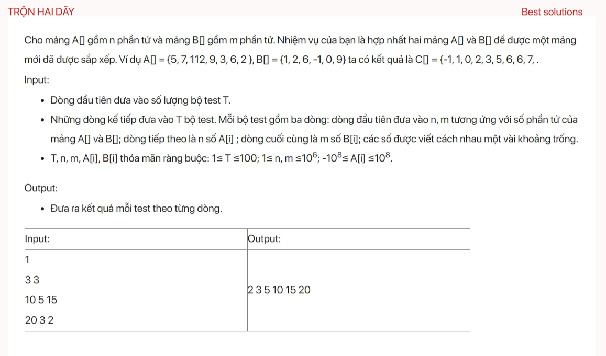

## dsa06017

## gpt 4 code
```
#include <iostream>
#include <vector>
#include <algorithm>
using namespace std;

void testCase() {
    int n, m;
    cin >> n >> m;
    vector<int> A(n), B(m);

    // Read elements for both arrays
    for (int i = 0; i < n; i++) {
        cin >> A[i];
    }
    for (int i = 0; i < m; i++) {
        cin >> B[i];
    }

    // Sort both arrays individually
    sort(A.begin(), A.end());
    sort(B.begin(), B.end());

    // Merge the two sorted arrays
    vector<int> C;
    int i = 0, j = 0;
    while (i < n && j < m) {
        if (A[i] < B[j]) {
            C.push_back(A[i++]);
        } else {
            C.push_back(B[j++]);
        }
    }

    // Include remaining elements from A
    while (i < n) {
        C.push_back(A[i++]);
    }

    // Include remaining elements from B
    while (j < m) {
        C.push_back(B[j++]);
    }

    // Output the merged sorted array
    for (int num : C) {
        cout << num << " ";
    }
}

int main() {
    int t;
    cin >> t;
    while (t--) {
        testCase();
        cout << endl;
    }
    return 0;
}

```