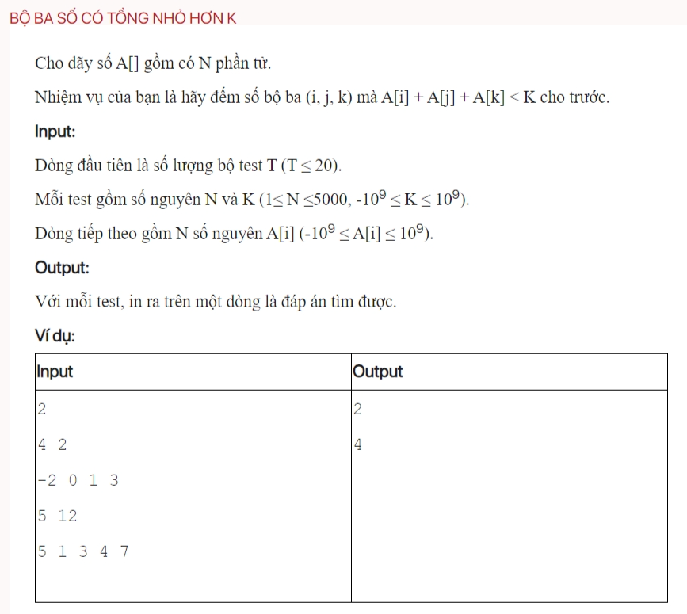

## dsa06032

### Time complexity

testCase function: 
- Sorting: O(nlogn)
- For loop: O(n^2)
- Total: O(n^2)
testCase2 function:
- Sorting: O(nlogn)
- For loop:
    +lower_bound: O(logn)
    +outside lower_bound(j loop): O(n)
    + i loop: O(n)
    -> Total: O(n^2 logn)
- Total: O(n^2 logn)