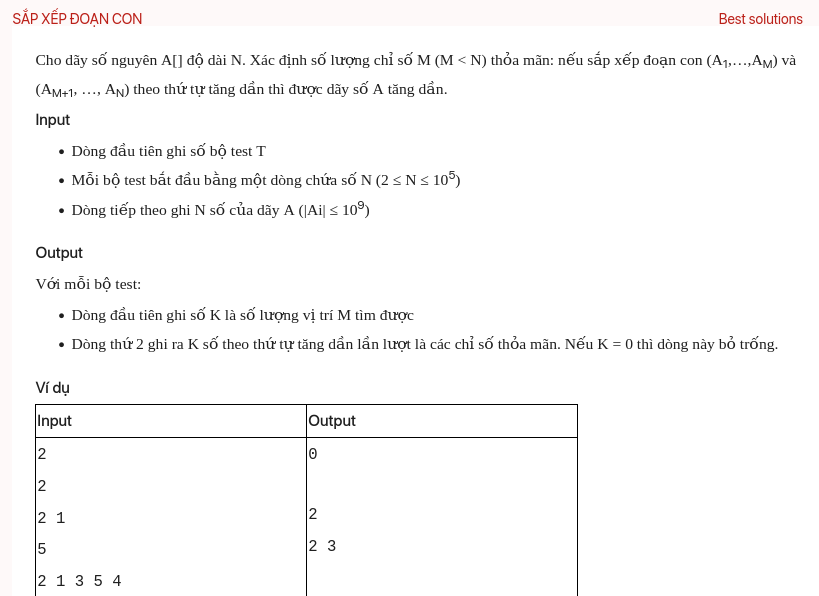

## dsa06037

## Algorithm
This problem is asking to find all indices `M` in the array `A` such that if we sort the subarray from `A[0]` to `A[M]` and the subarray from `A[M+1]` to `A[N-1]` separately, the entire array `A` will be sorted in ascending order.

Here's a step-by-step plan to solve this problem:

1. **Read the input**: First, read the number of test cases `T`. For each test case, read the size of the array `N` and the elements of the array `A`.

2. **Find the rightmost unsorted element**: Traverse the array from left to right and keep track of the maximum element found so far. If we find an element that is less than the maximum found so far, update the rightmost unsorted element's index.

3. **Find the leftmost unsorted element**: Traverse the array from right to left and keep track of the minimum element found so far. If we find an element that is greater than the minimum found so far, update the leftmost unsorted element's index.

4. **Find all valid `M`**: A valid `M` is an index such that all elements to the left of `M` are less than or equal to all elements to the right of `M`. To find all valid `M`, we can create two arrays `leftMax` and `rightMin` where `leftMax[i]` is the maximum element from `A[0]` to `A[i]` and `rightMin[i]` is the minimum element from `A[i]` to `A[N-1]`. Then, for each index `i` from `1` to `N-2`, if `leftMax[i] <= rightMin[i+1]`, `i` is a valid `M`.

5. **Output the result**: Print the number of valid `M` found and their indices in ascending order. If no valid `M` is found, print `0` and leave the next line blank.

This algorithm works because a valid `M` divides the array into two parts where all elements in the left part are less than or equal to all elements in the right part. By sorting each part separately, we can ensure that the entire array is sorted. The time complexity of this algorithm is O(N) for each test case as it only requires a single pass through the array to find the leftmost and rightmost unsorted elements and another pass to find all valid `M`.

### Complexity analysis
O(n) time and O(n) space