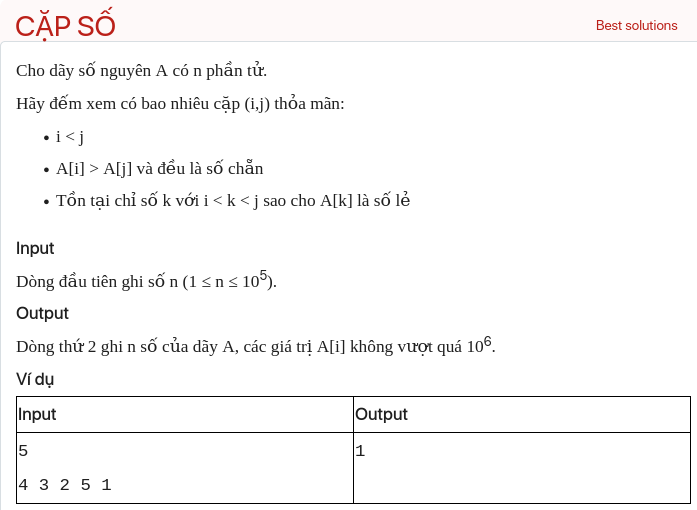

## dsa06038

Not done yet.
## Algorithm
The previous solution has a time complexity of O(n^2), which is not efficient for large inputs. We can optimize it to O(n) by using prefix and suffix arrays.

Here's the optimized plan:

1. **Read the input**: First, read the size of the array `n` and the elements of the array `A`.

2. **Initialize the arrays**: Initialize three arrays `prefixMin`, `suffixMin`, and `suffixOdd` of size `n`. `prefixMin[i]` will store the minimum even number from `A[0]` to `A[i]`, `suffixMin[i]` will store the minimum even number from `A[i]` to `A[n-1]`, and `suffixOdd[i]` will store `true` if there is an odd number in `A[i]` to `A[n-1]`, `false` otherwise.

3. **Fill the arrays**: Fill `prefixMin` from left to right, `suffixMin` and `suffixOdd` from right to left.

4. **Count the valid pairs**: Traverse the array from left to right. For each even number `A[i]`, if `A[i] > suffixMin[i+1]` and `suffixOdd[i+1]` is `true`, increment `count`.

5. **Output the result**: Print the value of `count`.

Here's the implementation in C++:

```cpp
#include <iostream>
#include <vector>
#include <climits>
using namespace std;

int main() {
    int n;
    cin >> n;
    vector<int> A(n);
    for (int &a : A) cin >> a;

    vector<int> prefixMin(n, INT_MAX), suffixMin(n, INT_MAX);
    vector<bool> suffixOdd(n, false);
    for (int i = 0; i < n; ++i) {
        if (A[i] % 2 == 0) {
            prefixMin[i] = i > 0 ? min(prefixMin[i-1], A[i]) : A[i];
        } else if (i > 0) {
            prefixMin[i] = prefixMin[i-1];
        }
    }
    for (int i = n-1; i >= 0; --i) {
        if (A[i] % 2 == 0) {
            suffixMin[i] = i < n-1 ? min(suffixMin[i+1], A[i]) : A[i];
        } else if (i < n-1) {
            suffixMin[i] = suffixMin[i+1];
        }
        suffixOdd[i] = (A[i] % 2 != 0) || (i < n-1 && suffixOdd[i+1]);
    }

    int count = 0;
    for (int i = 0; i < n-1; ++i) {
        if (A[i] % 2 == 0 && A[i] > suffixMin[i+1] && suffixOdd[i+1]) {
            ++count;
        }
    }

    cout << count << "\n";

    return 0;
}
```

This solution works in O(n) time and uses O(n) extra space.