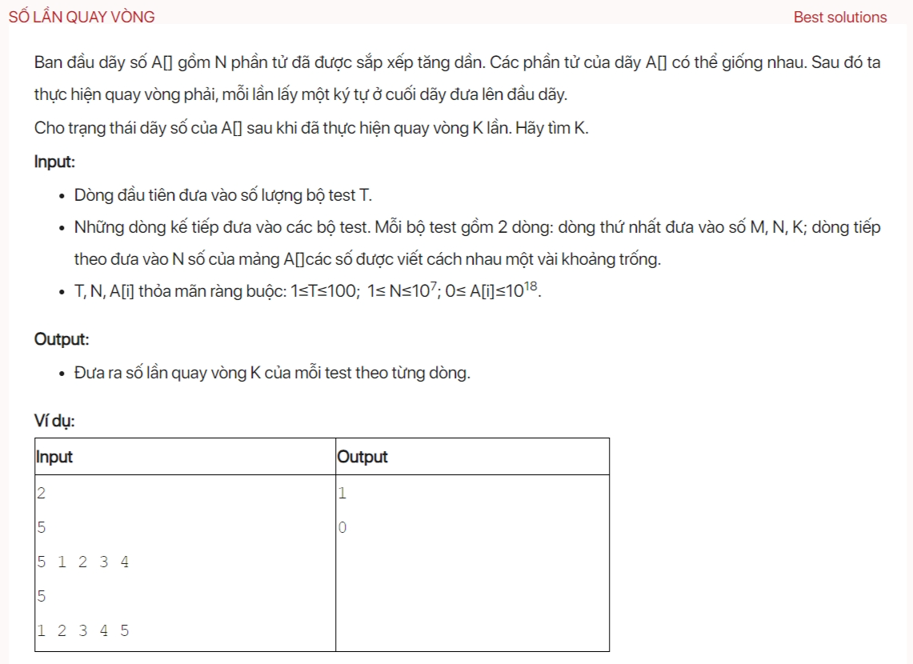

## dsa06048

### Algorithm
This function performs a binary search on the array A for the minimum element. It first checks if the array is already sorted. If it is, it returns the position of the first element. If not, it finds the middle element and its next and previous elements. If the middle element is less than or equal to both its next and previous elements, it is the minimum element and its position is returned. If not, it checks if the right half of the array is sorted. If it is, it discards the right half, otherwise it discards the left half. This process is repeated until the minimum element is found or the search space is exhausted. If the minimum element is found, its position is returned, otherwise -1 is returned.