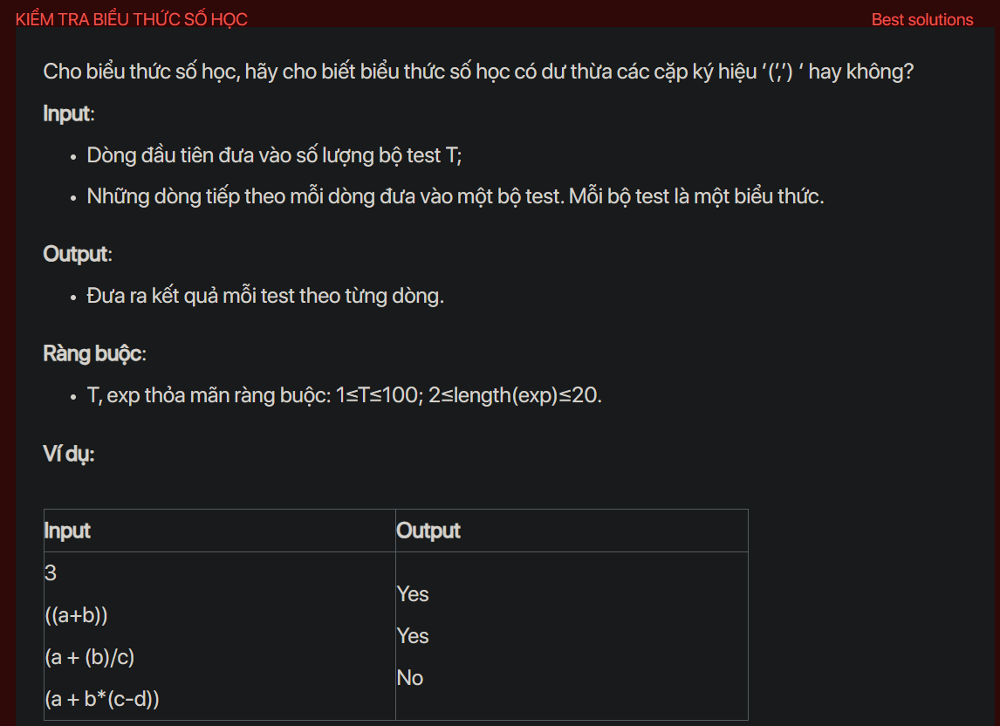

## dsa07003

## Approach
Sure, let's break down your code:

1. **Include necessary libraries:** You include the necessary libraries for your program. `bits/stdc++.h` is a header file in C++ which includes every standard library.

2. **Function Declarations:** You declare a function `testCase()` which will be defined later.

3. **Main Function:** The main function of your program begins. It first reads the number of test cases. Then it enters a loop which will iterate for each test case. For each test case, it calls the function `testCase()` and then prints a newline.

4. **Test Case Function:** This is where the main logic of your program resides. It reads a string `s` which is the arithmetic expression. It then iterates over each character in the string.

    - If the character is not a closing parenthesis `)`, it pushes the character onto the stack.
    
    - If the character is a closing parenthesis `)`, it enters a loop where it pops elements from the stack until it encounters an opening parenthesis `(`. During this process, if it encounters any operator (`+`, `-`, `*`, `/`), it sets a flag `ok` to `true`.
    
    - After the loop, if the flag `ok` is `false`, it means that the parentheses were redundant (as there was no operator inside them), so it prints "Yes" and returns from the function.
    
5. If the function has not returned after iterating over the entire string, it means that no redundant parentheses were found, so it prints "No".

This code works by checking each pair of parentheses in the expression to see if they contain an operator. If a pair of parentheses does not contain an operator, it means they are redundant and the function immediately returns "Yes". If no such pair of parentheses is found, the function returns "No".