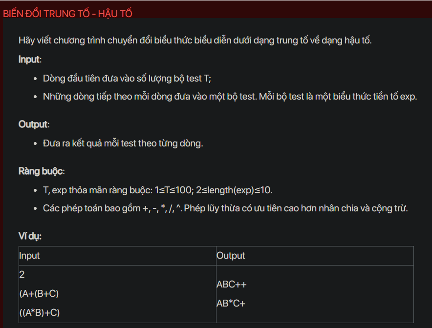

## dsa07008

## Approach
I'm sorry for the confusion, but the problem you're asking to solve doesn't involve binary search. It's a problem of converting infix expressions to postfix, which is typically solved using a stack data structure. Here's how you can approach it:

Problem Analysis:
The problem is asking to convert an infix expression to a postfix expression. 

Infix expression is the expression in which the operator is in between the two operands, like this: `operand1 operator operand2`

Postfix expression is the expression in which the operator is followed by operands, i.e., `operand1 operand2 operator`

Solution Analysis:
We can solve this problem using a stack. The idea is to iterate over the infix expression and do the following for every character:

- If the character is an operand, append it to the postfix expression.
- If the character is an operator, then pop operators from the stack and append them to the postfix expression until the top of the stack has an operator that has less precedence than the current operator, or the stack is empty, and then push the current operator to the stack.
- If the character is an opening bracket '(', push it to the stack.
- If the character is a closing bracket ')', then pop operators from the stack and append them to the postfix expression until an opening bracket '(' is encountered, and pop the opening bracket.

After the infix expression is completely processed, pop all the operators from the stack and append them to the postfix expression.

Implementation in C++:

```cpp
#include<bits/stdc++.h>
using namespace std;

int precedence(char op){
    if(op == '^')
    return 3;
    if(op == '*' || op == '/')
    return 2;
    if(op == '+' || op == '-')
    return 1;
    return -1;
}

string infixToPostfix(string s) {
    stack<char> st;
    string result;
    for (char c : s) {
        if (isalpha(c)) {
            result += c;
        } else if (c == '(') {
            st.push(c);
        } else if (c == ')') {
            while (!st.empty() && st.top() != '(') {
                result += st.top();
                st.pop();
            }
            st.pop();
        } else {
            while (!st.empty() && precedence(c) <= precedence(st.top())) {
                result += st.top();
                st.pop();
            }
            st.push(c);
        }
    }
    while (!st.empty()) {
        result += st.top();
        st.pop();
    }
    return result;
}

int main() {
    int T;
    cin >> T;
    while (T--) {
        string s;
        cin >> s;
        cout << infixToPostfix(s) << endl;
    }
    return 0;
}
```

Time Complexity Analysis:
The time complexity of the above solution is O(N) because we use a single loop to iterate over the string. The space complexity is O(N) for the stack.