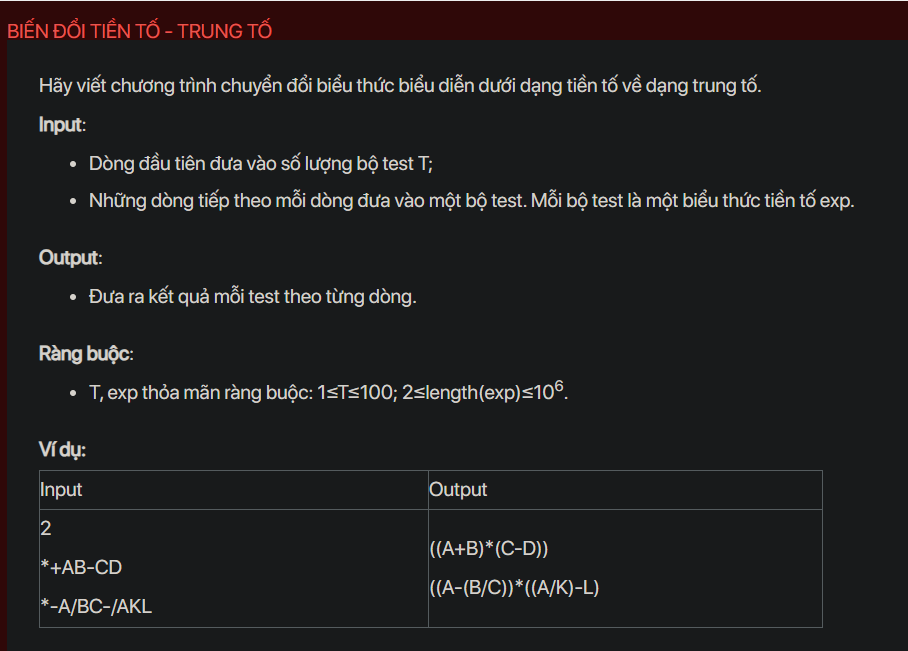

## dsa07009


## Approach
**Problem Analysis:**

The problem is asking to convert a prefix expression to an infix expression. In prefix notation, the operator is placed before the operands. In infix notation, the operator is placed between the operands.

**Solution Analysis:**

We can solve this problem by using a stack. We iterate the prefix expression from right to left. If the current character is an operand, we push it into the stack. If the current character is an operator, we pop two operands from the stack, combine them with the operator in infix form (operand1 + operator + operand2), and push the result back into the stack. At the end, the stack should contain a single element which is the infix expression.

**Implementation in C++:**

```cpp
#include<bits/stdc++.h>
using namespace std;

bool isOperator(char x) {
    switch (x) {
        case '+':
        case '-':
        case '/':
        case '*':
            return true;
    }
    return false;
}

string preToInfix(string pre_exp) {
    stack<string> s;
    int length = pre_exp.size();
    for (int i = length - 1; i >= 0; i--) {
        if (isOperator(pre_exp[i])) {
            string op1 = s.top(); s.pop();
            string op2 = s.top(); s.pop();
            string temp = "(" + op1 + pre_exp[i] + op2 + ")";
            s.push(temp);
        } else {
            s.push(string(1, pre_exp[i]));
        }
    }
    return s.top();
}

int main() {
    int T;
    cin >> T;
    while (T--) {
        string pre_exp;
        cin >> pre_exp;
        cout << preToInfix(pre_exp) << endl;
    }
    return 0;
}
```

**Time Complexity Analysis:**

The time complexity of the solution is O(n) where n is the length of the prefix expression. This is because we are iterating through the prefix expression once. The space complexity is also O(n) for the stack.