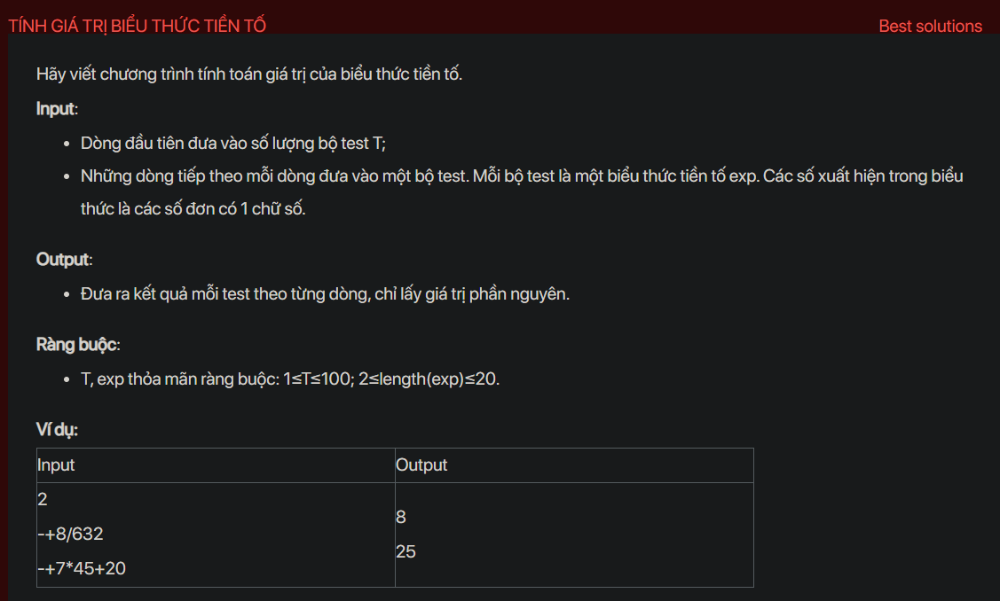

## dsa07014


## Approach
**Problem Analysis:**

The problem is asking to evaluate a prefix expression. In prefix notation, the operator is placed before the operands.

**Solution Analysis:**

We can solve this problem by using a stack. We iterate the prefix expression from right to left. If the current character is an operand, we push it into the stack. If the current character is an operator, we pop two operands from the stack, perform the operation, and push the result back into the stack. At the end, the stack should contain a single element which is the result of the expression.

**Implementation in C++:**

```cpp
#include<bits/stdc++.h>
using namespace std;

bool isOperator(char x) {
    switch (x) {
        case '+':
        case '-':
        case '/':
        case '*':
            return true;
    }
    return false;
}

int evaluatePrefix(string exp) {
    stack<int> s;
    for (int i = exp.size() - 1; i >= 0; i--) {
        if (isOperator(exp[i])) {
            int op1 = s.top(); s.pop();
            int op2 = s.top(); s.pop();
            switch (exp[i]) {
                case '+': s.push(op1 + op2); break;
                case '-': s.push(op1 - op2); break;
                case '*': s.push(op1 * op2); break;
                case '/': s.push(op1 / op2); break;
            }
        } else {
            s.push(exp[i] - '0');
        }
    }
    return s.top();
}

int main() {
    int T;
    cin >> T;
    while (T--) {
        string exp;
        cin >> exp;
        cout << evaluatePrefix(exp) << endl;
    }
    return 0;
}
```

**Time Complexity Analysis:**

The time complexity of the solution is O(n) where n is the length of the prefix expression. This is because we are iterating through the prefix expression once. The space complexity is also O(n) for the stack.