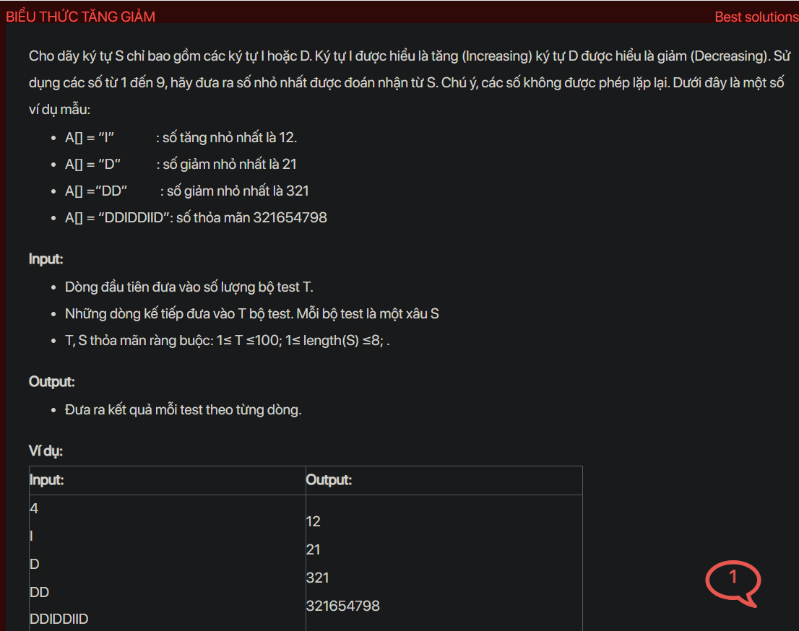

## dsa07016

## Approach
Problem Analysis:
The problem is asking to generate the smallest number that follows the pattern of 'I' and 'D' where 'I' means increasing and 'D' means decreasing. The number should be formed using digits from 1 to 9 and each digit can be used only once.

Solution Analysis:
We can solve this problem using a stack. The idea is to iterate over the pattern and do the following for every character:

- Push the index of the character (starting from 1) to the stack.
- If the character is 'I' or it's the last character in the pattern, pop all elements from the stack and append them to the result.

Implementation in C++:

```cpp
#include<bits/stdc++.h>
using namespace std;

void printMinNumberForPattern(string seq) {
    stack<int> stk;
    string result;
    for (int i = 0; i <= seq.size(); i++) {
        stk.push(i + 1);
        if (i == seq.size() || seq[i] == 'I') {
            while (!stk.empty()) {
                result += to_string(stk.top());
                stk.pop();
            }
        }
    }
    cout << result << endl;
}

int main() {
    int T;
    cin >> T;
    while (T--) {
        string seq;
        cin >> seq;
        printMinNumberForPattern(seq);
    }
    return 0;
}
```

Time Complexity Analysis:
The time complexity of the above solution is O(N) because we use a single loop to iterate over the string. The space complexity is O(N) for the stack.