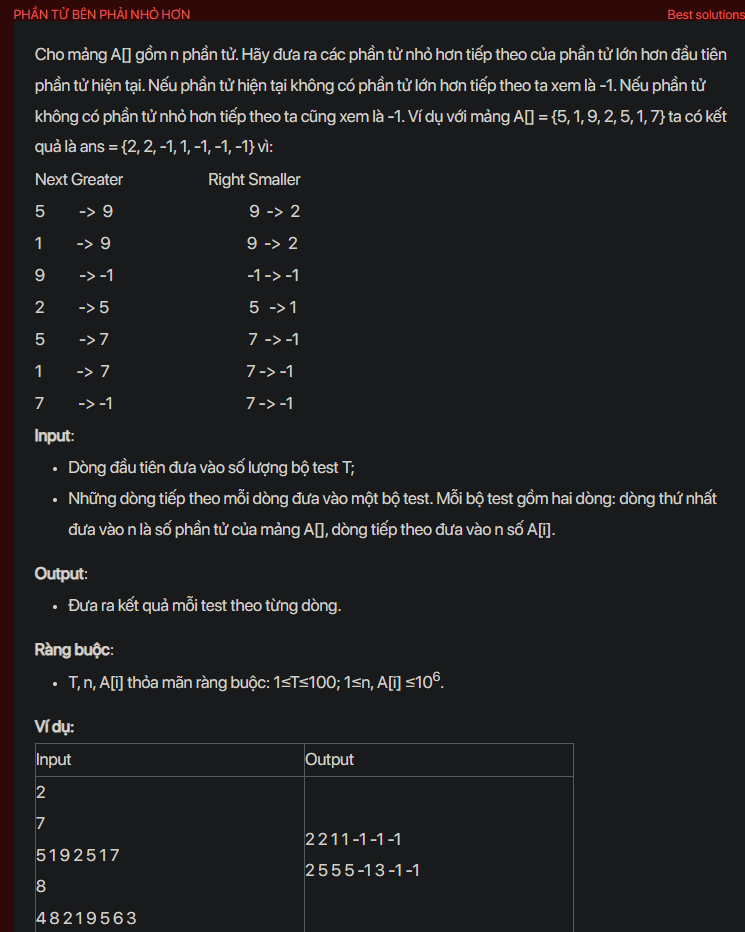

## dsa07017

## Explain
Sure, let's break down the algorithm in your code.

This algorithm is used to find the next greater element and the next smaller element for every element in an array. The main idea is to use a stack to keep track of the elements that we have seen so far.

Here's a step-by-step explanation of the algorithm:

1. **Initialization:** The code first reads the number of elements `n` and the elements of the array `a[]`. It also initializes two arrays `gr[]` and `le[]` to store the indices of the next greater and next smaller elements respectively.

2. **Finding the next greater elements:** The code then iterates over the elements of `a[]` in reverse order. For each element `a[i]`, it pops elements from the stack until it finds an element greater than `a[i]` or the stack becomes empty. If it finds a greater element, it sets `gr[i]` to the index of this element. If the stack becomes empty, it sets `gr[i]` to -1. After that, it pushes the index `i` onto the stack.

3. **Finding the next smaller elements:** The code clears the stack and then iterates over the elements of `a[]` in reverse order again. This time, for each element `a[i]`, it pops elements from the stack until it finds an element smaller than `a[i]` or the stack becomes empty. If it finds a smaller element, it sets `le[i]` to this element. If the stack becomes empty, it sets `le[i]` to -1. After that, it pushes the element `a[i]` onto the stack.

4. **Output:** Finally, the code iterates over the elements of `a[]` again. For each element `a[i]`, if `gr[i]` is -1, it outputs -1. Otherwise, it outputs `le[gr[i]]`. This is the next smaller element of the next greater element of `a[i]`.

The reason this algorithm works is that it uses a stack to keep track of the elements that we have seen so far. When we see a new element, we can quickly find the next greater or smaller element by looking at the top of the stack. This makes the algorithm very efficient.

```cpp
#include <bits/stdc++.h>
using namespace std;
void testCase();
int main() {
    // Write your code here
    #ifndef ONLINE_JUDGE
    freopen("input.txt", "r", stdin);
    freopen("output.txt", "w", stdout);
    #endif
    int t;
    cin >> t;
    while (t--) {
        testCase();
        cout << endl;
    }
    return 0;
}
void testCase() {
    int n;
    cin >> n;
    int a[n + 1], gr[n + 1], le[n + 1];
    for (int i = 1; i <= n; i++) {
        cin >> a[i];
    }
    stack<int> st;
    for (int i = n; i >= 1; i--) {
        while (!st.empty() && a[st.top()] <= a[i]) {
            st.pop();
        }
        if (st.empty()) {
            gr[i] = -1;
        } else {
            gr[i] = st.top();
        }
        st.push(i);//push index cua so lon hon dau tien ben phai cua a[i]
    }
    while (!st.empty()) {
        st.pop();//clear stack
    }
    for (int i = n; i >= 1; i--) {
        while (!st.empty() && st.top() >= a[i]) {
            st.pop();
        }
        if (st.empty()) {
            le[i] = -1;
        } else {
            le[i] = st.top();
        }
        st.push(a[i]);//push so nho hon dau tien ben phai cua a[i]
    }
    for (int i = 1; i <= n; i++) {
        if (gr[i] == -1) {
            cout << -1;
        } else {
            cout << le[gr[i]];
        }
        cout << " ";
    }
}
```