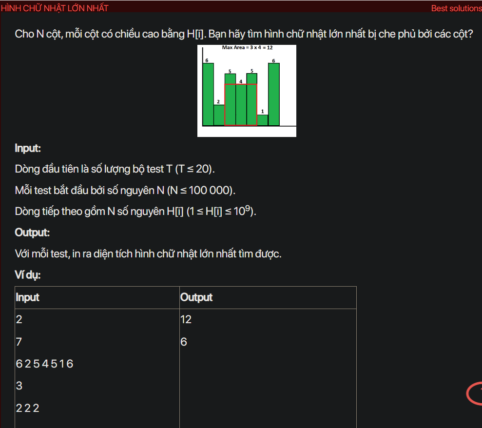

## dsa07019

## Explain
This problem is about finding the largest rectangular area in a histogram. The histogram is represented by an array of integers, where each integer represents the height of a bar and the width of each bar is 1.

Here's a step-by-step explanation of the algorithm used in your code:

1. **Initialization:** The code first reads the number of test cases `t` and for each test case, it reads the number of bars `n` and their heights `a[i]`. It also initializes two arrays `l[]` and `r[]` to store the indices of the nearest smaller bars on the left and right of each bar.

2. **Finding the nearest smaller bars on the left:** The code then iterates over the bars from left to right. For each bar `a[i]`, it pops bars from the stack until it finds a bar smaller than `a[i]` or the stack becomes empty. If it finds a smaller bar, it sets `l[i]` to the index of this bar plus 1. If the stack becomes empty, it sets `l[i]` to 1. After that, it pushes the index `i` onto the stack.

3. **Finding the nearest smaller bars on the right:** The code clears the stack and then iterates over the bars from right to left. This time, for each bar `a[i]`, it pops bars from the stack until it finds a bar smaller than `a[i]` or the stack becomes empty. If it finds a smaller bar, it sets `r[i]` to the index of this bar minus 1. If the stack becomes empty, it sets `r[i]` to `n`. After that, it pushes the index `i` onto the stack.

4. **Calculating the maximum area:** The code then iterates over the bars again. For each bar `a[i]`, it calculates the area of the largest rectangle that can be formed using `a[i]` as the shortest bar. The width of this rectangle is `r[i] - l[i] + 1` and the height is `a[i]`, so the area is `a[i] * (r[i] - l[i] + 1)`. It keeps track of the maximum area in the variable `res`.

5. **Output:** Finally, the code outputs the maximum area `res`.

The reason this algorithm works is that it uses a stack to keep track of the bars that we have seen so far. When we see a new bar, we can quickly find the nearest smaller bars by looking at the top of the stack. This makes the algorithm very efficient.

```cpp
#include <bits/stdc++.h>
using namespace std;
// y tuong, tai 1 vi tri tim ra diem gan nhat, gia tri lon nhat nho hon no
void testCase();
int main() {
    // Write your code here
    #ifndef ONLINE_JUDGE
    freopen("input.txt", "r", stdin);
    freopen("output.txt", "w", stdout);
    #endif
    int t;
    cin >> t;
    while (t--) {
        testCase();
        cout << endl;
    }
    return 0;
}
void testCase() {
    int n;
    cin >> n;
    int a[n + 1], l[n + 1], r[n + 1];
    for (int i = 1; i <= n; i++) {
        cin >> a[i];
    }
    stack<int> st;
    for(int i=  1; i <= n; i++) {
        while (!st.empty() && a[st.top()] >= a[i]) {
            st.pop();
        }
        if (st.empty()) {
            l[i] = 1;
        } else {
            l[i] = st.top() + 1;
        }
        st.push(i);
    }
    while (!st.empty()) {
        st.pop();
    }
    for (int i = n; i >= 1; i--) {
        while (!st.empty() && a[st.top()] >= a[i]) {
            st.pop();
        }
        if (st.empty()) {
            r[i] = n;
        } else {
            r[i] = st.top() - 1;
        }
        st.push(i);
    }
    long long res = 0;
    for (int i = 1; i <= n; i++) {
        long long s = (long long) a[i] * (r[i] - l[i] + 1);
        res = max(res, s);
    }
    cout << res;

}
```