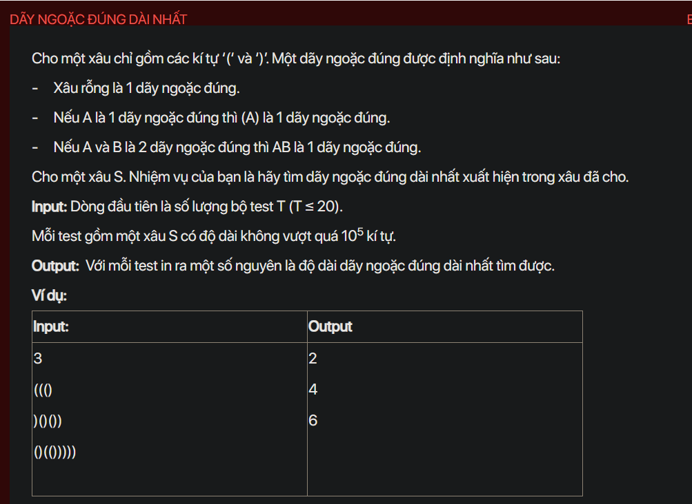

## dsa07021

## Approach
**Problem Analysis:**

The problem is asking to find the length of the longest valid (well-formed) parentheses substring.

**Solution Analysis:**

The solution to this problem involves using a stack data structure. We iterate through the string and for each character:
- If it is an opening bracket, we push its index to the stack.
- If it is a closing bracket, we first check if the stack is not empty and the top of the stack is an opening bracket, we pop from the stack and calculate the length of the current valid string of parentheses (by subtracting the current index with the new top of stack index). If the stack is empty or the top of the stack is not an opening bracket, we push the current index to the stack.

The stack is used to keep track of the indices of the non-matching parentheses. After the end of the string, the stack will only contain the indices of the non-matching parentheses. The length of the longest valid parentheses substring is the length of the longest continuous subarray.

**Implementation in C++:**

```cpp
#include<bits/stdc++.h>
using namespace std;

int main() {
    int T;
    cin >> T;
    while (T--) {
        string S;
        cin >> S;
        stack<int> st;
        st.push(-1);
        int maxLength = 0;
        for (int i = 0; i < S.size(); i++) {
            if (S[i] == '(') {
                st.push(i);
            } else {
                st.pop();
                if (!st.empty()) {
                    maxLength = max(maxLength, i - st.top());
                } else {
                    st.push(i);
                }
            }
        }
        cout << maxLength << endl;
    }
    return 0;
}
```

**Time Complexity Analysis:**

The time complexity of the solution is O(n) where n is the length of the string. This is because we are processing each character once. The space complexity is O(n) for the stack.