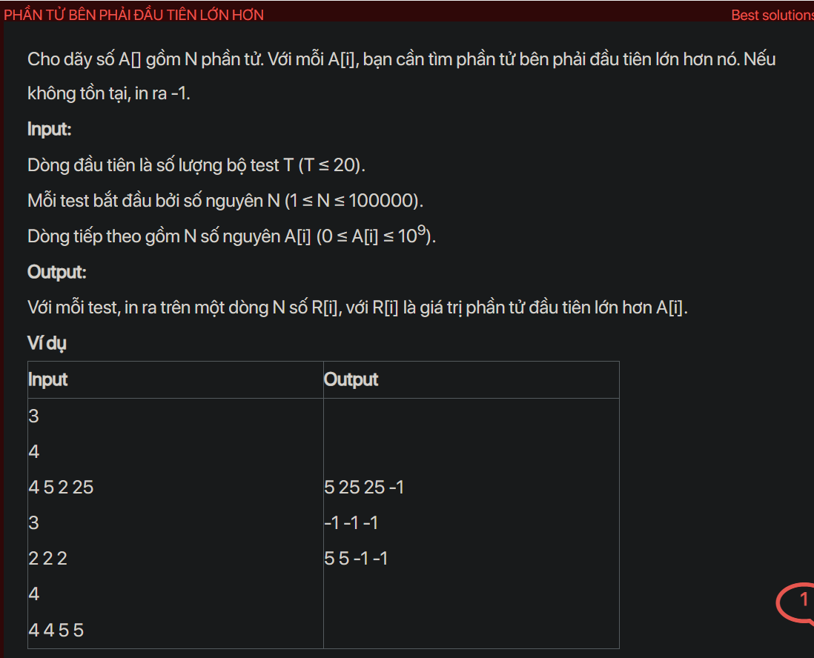

## dsa07027

## Approach
**Problem Analysis:**

The problem is asking to find the next greater element for every element in an array. If there is no greater element to the right of a particular element, we print -1.

**Solution Analysis:**

The solution to this problem involves using a stack data structure. We iterate through the array from right to left and for each element:
- While the stack is not empty and the top of the stack is less than or equal to the current element, we pop from the stack.
- If the stack is empty after the above operation, it means there is no greater element to the right of the current element, so we print -1.
- If the stack is not empty, the top of the stack is the next greater element, so we print it.
- We push the current element to the stack.

**Implementation in C++:**

```cpp
#include<bits/stdc++.h>
using namespace std;

int main() {
    int T;
    cin >> T;
    while (T--) {
        int N;
        cin >> N;
        vector<int> A(N);
        for (int i = 0; i < N; i++) {
            cin >> A[i];
        }
        stack<int> st;
        vector<int> ans(N);
        for (int i = N - 1; i >= 0; i--) {
            while (!st.empty() && st.top() <= A[i]) {
                st.pop();
            }
            ans[i] = st.empty() ? -1 : st.top();
            st.push(A[i]);
        }
        for (int i = 0; i < N; i++) {
            cout << ans[i] << " ";
        }
        cout << endl;
    }
    return 0;
}
```

**Time Complexity Analysis:**

The time complexity of the solution is O(n) where n is the number of elements in the array. This is because we are processing each element once. The space complexity is O(n) for the stack and the answer array.