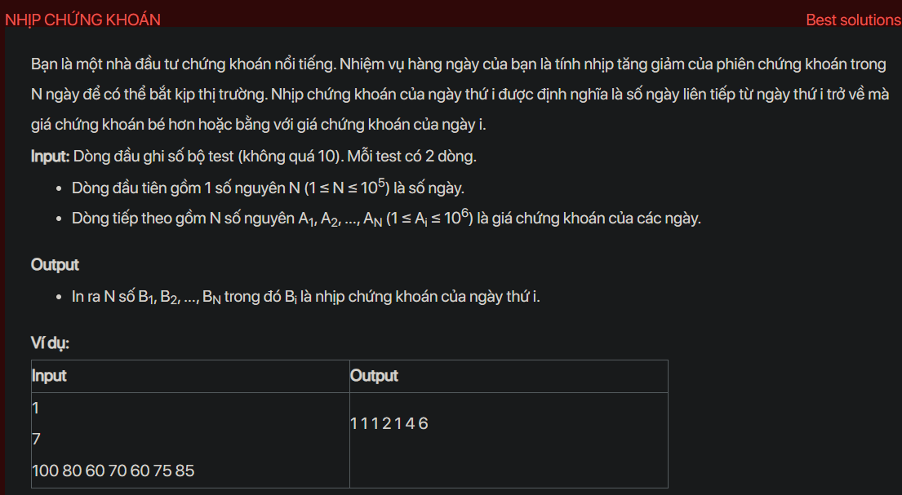

## dsa07028

## Approach
Problem Analysis:
The problem is asking to find the number of consecutive days before and including the current day where the stock price is less than or equal to the current day's stock price.

Solution Analysis:
We can solve this problem using a stack. The idea is to iterate over the array and do the following for every element:

- While the stack is not empty and the top of the stack is greater than the current element, pop elements from the stack.
- If the stack is empty, then the current element is the smallest so far, so the stock span is the current index plus 1.
- If the stack is not empty, then the stock span is the difference between the current index and the index of the top element of the stack.
- Push the current index to the stack.

Implementation in C++:

```cpp
#include<bits/stdc++.h>
using namespace std;

void calculateSpan(int price[], int n) {
    stack<int> s;
    vector<int> span(n);
    for (int i = 0; i < n; i++) {
        while (!s.empty() && price[s.top()] <= price[i]) {
            s.pop();
        }
        span[i] = (s.empty()) ? (i + 1) : (i - s.top());
        s.push(i);
    }
    for (int i = 0; i < n; i++) {
        cout << span[i] << " ";
    }
    cout << endl;
}

int main() {
    int T;
    cin >> T;
    while (T--) {
        int n;
        cin >> n;
        int price[n];
        for (int i = 0; i < n; i++) cin >> price[i];
        calculateSpan(price, n);
    }
    return 0;
}
```

Time Complexity Analysis:
The time complexity of the above solution is O(N) because we use a single loop to iterate over the array. The space complexity is O(N) for the stack and the output array.