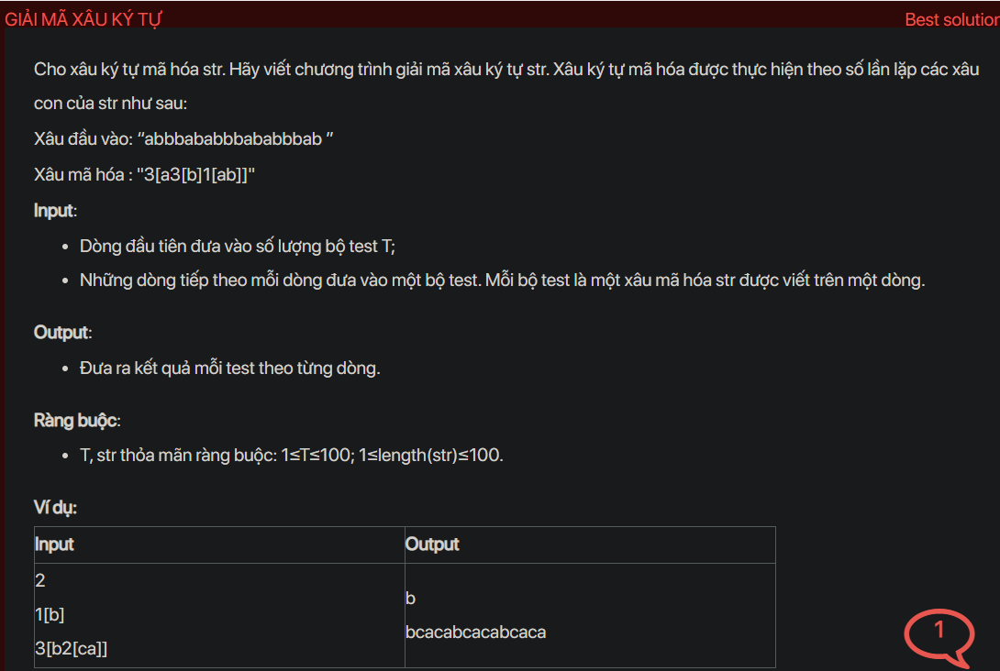

## dsa07029


## Explain
The problem is about decoding a string that has been encoded in a specific format. The format is a number followed by a bracketed string, where the number indicates how many times the bracketed string should be repeated.

Here's a step-by-step explanation of the algorithm used in your code:

1. **Initialization:** The code first reads the number of test cases `T`. For each test case, it reads the encoded string `s`. It also initializes two stacks `st1` and `st2`. `st1` is used to store parts of the decoded string and `st2` is used to store the repetition counts.

2. **Decoding the string:** The code then iterates over the characters of `s`. For each character `s[i]`:

   - If `s[i]` is a digit, it calculates the number `num` that this digit is a part of and pushes `num` onto `st2`.

   - If `s[i]` is a ']', it pops strings from `st1` until it finds a '[', concatenates these strings in reverse order to form a string `tmp`, pops the repetition count `dem` from `st2`, repeats `tmp` `dem` times to form a string `res`, and pushes `res` onto `st1`.

   - Otherwise, it pushes `s[i]` onto `st1`. If `s[i]` is a '[', it also pushes 1 onto `st2` if `s[i]` is not preceded by a digit.

3. **Output:** Finally, the code pops strings from `st1`, concatenates these strings in reverse order to form the decoded string `ans`, and outputs `ans`.

The reason this algorithm works is that it uses two stacks to keep track of the parts of the decoded string and their repetition counts. When it sees a ']', it knows that it has reached the end of a bracketed string and it can repeat this string the number of times indicated by the top of `st2`. This makes the algorithm very efficient.


```cpp
// https://code.ptit.edu.vn/student/question/DSA07029
// GIẢI MÃ XÂU KÝ TỰ

#include <bits/stdc++.h>
using namespace std;

void testCase() {
    string s; cin >> s;
    stack<string> st1;
    stack<int> st2;
    for (int i = 0; i < s.length(); ++i) {
        if (s[i] >= '0' && s[i] <= '9') {
            int num = 0;
            while (i < s.length() && s[i] >= '0' && s[i] <= '9') {
                num = num * 10 + (s[i] - '0');
                i++;
            }
            i--;
            st2.push(num);
        }
        else if (s[i] == ']') {
            string tmp = "";
            while (st1.top() != "[") {
                tmp = st1.top() + tmp;
                st1.pop();
            }
            st1.pop(); // bo dau [

            string res = "";
            int dem = st2.top(); st2.pop();
            while (dem--) res += tmp;
            st1.push(res);
        }
        else {
            st1.push(string(1, s[i]));
            if (s[i] == '[' && (i == 0 || s[i - 1] < '0' || s[i - 1] > '9'))
                st2.push(1);
        }
    }

    string ans = "";
    while (!st1.empty()) {
        ans = st1.top() + ans;
        st1.pop();
    }
    cout << ans;
}

int main() {
    ios_base::sync_with_stdio(false);
    cin.tie(NULL); cout.tie(NULL);
    #ifndef ONLINE_JUDGE
    freopen("input.txt", "r", stdin);
    freopen("output.txt", "w", stdout);
    #endif
    int T = 1; cin >> T;
    while (T--) {
        testCase();
        cout << "\n";
    }
    return 0;
}
```