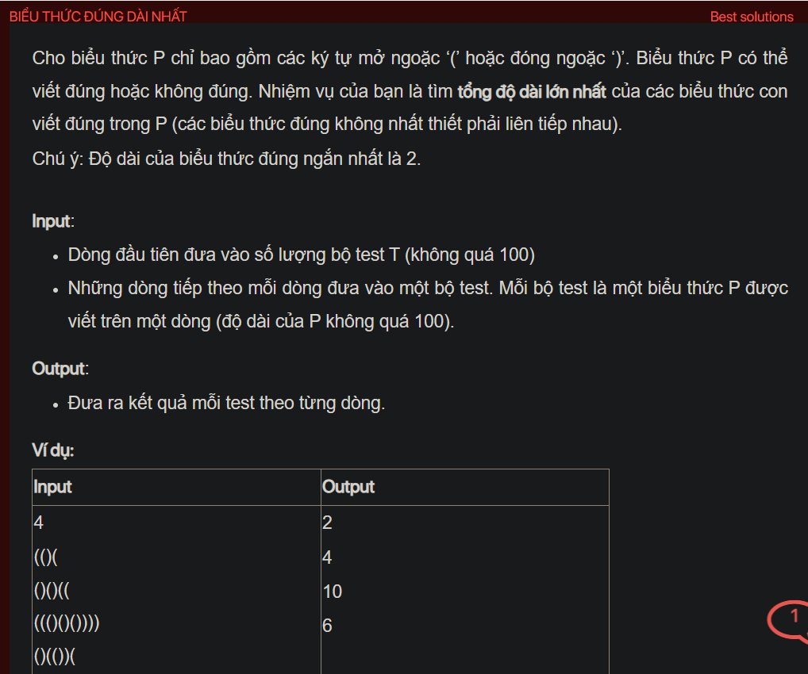

## dsa07041


## Explain
The problem is about finding the length of the longest valid substring in a given string of parentheses. A valid substring is a sequence of parentheses that can be correctly opened and closed.

Here's a step-by-step explanation of the algorithm used in your code:

1. **Initialization:** The code first reads the number of test cases `t`. For each test case, it reads the string of parentheses `s`. It also initializes a stack `st` to keep track of the indices of the parentheses.

2. **Processing the string:** The code then iterates over the characters of `s`. For each character `s[i]`:

   - If `s[i]` is a ')' and the stack is not empty and the top of the stack is a '(', it pops the top of the stack.

   - Otherwise, it pushes `s[i]` onto the stack.

3. **Calculating the length of the longest valid substring:** After processing the string, the size of the stack is the number of invalid parentheses in `s`. The length of the longest valid substring is the total length of `s` minus the number of invalid parentheses.

4. **Output:** Finally, the code outputs the length of the longest valid substring.

The reason this algorithm works is that it uses a stack to keep track of the indices of the parentheses. When it sees a ')', it checks if the top of the stack is a '('. If it is, it knows that it has found a valid pair of parentheses and it can pop the top of the stack. If it is not, it knows that the ')' is invalid and it pushes it onto the stack. This makes the algorithm very efficient.

```cpp
#include <bits/stdc++.h>
using namespace std;
void testCase();
int main() {
    // Write your code here
    #ifndef ONLINE_JUDGE
    freopen("input.txt", "r", stdin);
    freopen("output.txt", "w", stdout);
    #endif
    int t;
    cin >> t;
    while (t--) {
        testCase();
        cout << endl;
    }
    return 0;
}
void testCase() {
    string s;
    cin >> s;
    stack<char> st;
    for (int i = 0; i < s.size(); i++) {
        if (s[i] == ')' && !st.empty() && st.top() == '(') {
            st.pop();
        } else {
            st.push(s[i]);
        }
    }
    cout << s.size() - st.size();
}
```