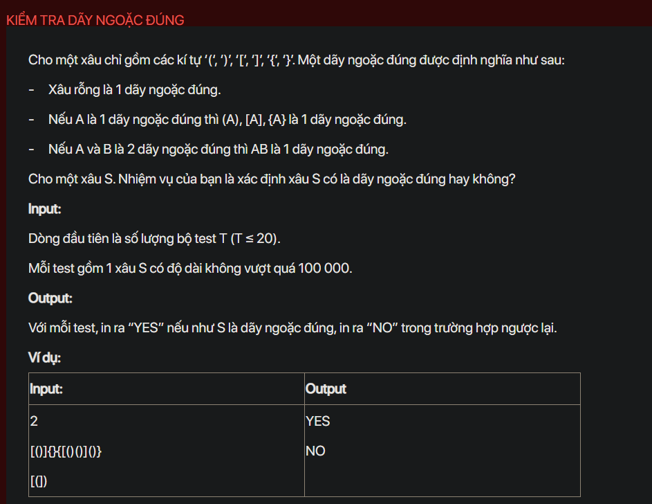

## dsa07110

## Approach
**Problem Analysis:**

The problem is asking to check if a given string of brackets is balanced or not. A string of brackets is balanced if every opening bracket has a corresponding closing bracket of the same type and the brackets are properly nested.

**Solution Analysis:**

The solution to this problem involves using a stack data structure. We iterate through the string and for each character:
- If it is an opening bracket, we push it to the stack.
- If it is a closing bracket, we check the top of the stack. If the top of the stack is the corresponding opening bracket, we pop from the stack. Otherwise, the string is not balanced.
- If the stack is empty when we encounter a closing bracket, the string is not balanced.

After iterating through the string, if the stack is not empty, it means there are unmatched opening brackets, so the string is not balanced. If the stack is empty, the string is balanced.

**Implementation in C++:**

```cpp
#include<bits/stdc++.h>
using namespace std;

bool isMatching(char a, char b) {
    return ((a == '(' && b == ')') || (a == '[' && b == ']') || (a == '{' && b == '}'));
}

int main() {
    int T;
    cin >> T;
    while (T--) {
        string S;
        cin >> S;
        stack<char> st;
        bool isBalanced = true;
        for (char c : S) {
            if (c == '(' || c == '[' || c == '{') {
                st.push(c);
            } else {
                if (st.empty() || !isMatching(st.top(), c)) {
                    isBalanced = false;
                    break;
                }
                st.pop();
            }
        }
        if (!st.empty()) {
            isBalanced = false;
        }
        cout << (isBalanced ? "YES" : "NO") << endl;
    }
    return 0;
}
```

**Time Complexity Analysis:**

The time complexity of the solution is O(n) where n is the length of the string. This is because we are processing each character once. The space complexity is O(n) for the stack.